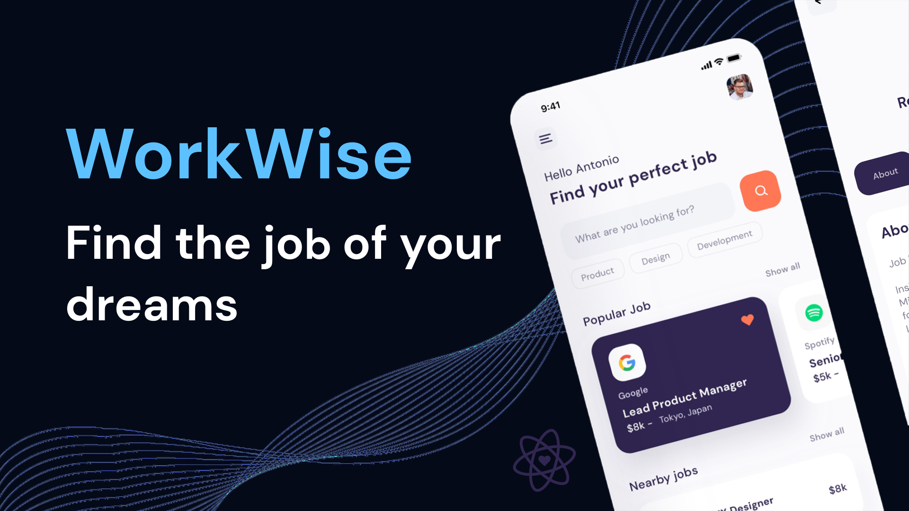

# WorkWise

## About the project 
Along with the creation of this application:
- Develop visually appealing UI/UX designs
- retrieve data from external APIs and integrate them
- Implement search and pagination functions
- Create custom hooks to retrieve data from the API
- write clean, organized and maintainable code with the right architecture

📲 My telegram you can text me [Telegram](https://t.me/Voloshanovskiy_V)

